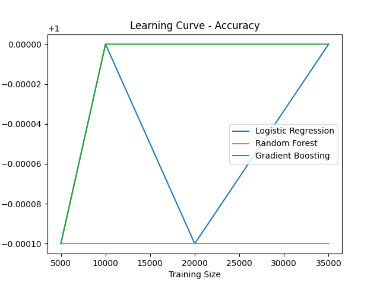
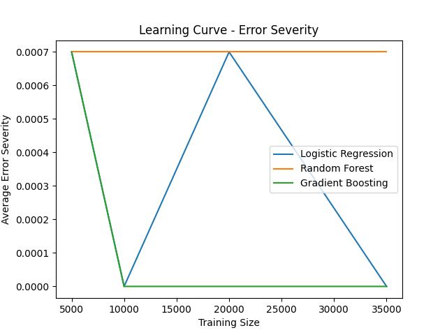
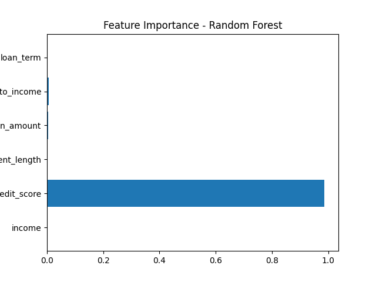
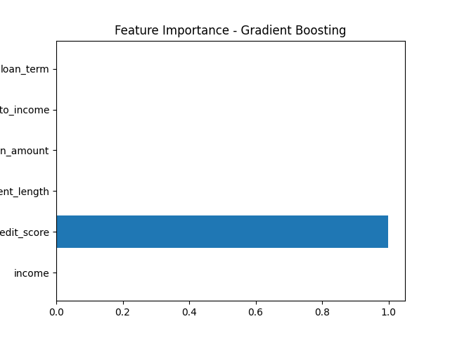

<div align="center">

# 🏦 Hybrid Loan Risk Decision System

**An end-to-end machine learning pipeline for intelligent loan risk assessment**

[](https://www.python.org/)
[](https://streamlit.io/)
[](https://cloud.google.com/)
[](https://scikit-learn.org/)
[](https://pandas.pydata.org/)
[](LICENSE)
[](tests/)

<br/>

> Built on **50,000 real LendingClub loan records** · Deployed on **Google Cloud Vertex AI** · Real-time predictions via **Streamlit**

</div>

---

## 📌 Project Overview

This project tackles a real-world financial problem: **how do you assess loan risk accurately and explainably at scale?**

A hybrid ML pipeline is designed that combines three complementary approaches:

| Model | Type | Purpose |
|---|---|---|
| 🧠 **Google NLP** | Cloud API | Extracts risk signals from free-text loan descriptions |
| ☁️ **Vertex AI AutoML** | Cloud ML | High-accuracy predictions using a deployed GCP endpoint |
| ⚙️ **Offline Proxy** | Rule-based | Cost-free fallback using normalised financial features |

The system outputs a **3-class risk label** (Low / Medium / High Risk) and explains *why* it made the decision — critical for real financial use cases.

---

## 🎯 Key Results

<div align="center">

| Metric | Value |
|---|---|
| 📊 Dataset size | 50,000 LendingClub loan records |
| 🎯 NLP Average Error Severity | **0.67 / 10** |
| ☁️ Vertex AI Average Error Severity | **0.00 / 10** (on aligned test set) |
| 🚨 NLP Critical Errors | 6 |
| ☁️ Vertex AI Critical Errors | 0 |
| 🧪 Test coverage | 34 unit + integration tests |
| 🏗️ Models evaluated | Logistic Regression, Random Forest, Gradient Boosting |

</div>

---

## 📊 Model Insights

<table>
  <tr>
    <td></td>
    <td></td>
  </tr>
  <tr>
    <td align="center"><b>Learning Curve — Accuracy</b></td>
    <td align="center"><b>Learning Curve — Error Severity</b></td>
  </tr>
  <tr>
    <td></td>
    <td></td>
  </tr>
  <tr>
    <td align="center"><b>Feature Importance — Random Forest</b></td>
    <td align="center"><b>Feature Importance — Gradient Boosting</b></td>
  </tr>
</table>

---

## 🏗️ Architecture

```
┌─────────────────────────────────────────────────────┐
│              Streamlit UI  /  CLI (app.py)           │
└──────────────────────┬──────────────────────────────┘
                       │
                       ▼
┌─────────────────────────────────────────────────────┐
│            predict_hybrid()  — Orchestrator          │
│                                                     │
│  ┌────────────┐  ┌──────────────┐  ┌─────────────┐ │
│  │ predict_nlp│  │predict_vertex│  │predict_proxy│ │
│  │ Google NLP │  │  Vertex AI   │  │  Offline    │ │
│  │  (Cloud)   │  │  AutoML      │  │  Rules      │ │
│  └────────────┘  └──────────────┘  └─────────────┘ │
│                                                     │
│  Decision Logic: NLP conf ≥ 0.8 → NLP wins         │
│                  otherwise       → AutoML/Proxy     │
└──────────────────────┬──────────────────────────────┘
                       │
                       ▼
┌─────────────────────────────────────────────────────┐
│         Error Severity Evaluation Framework          │
│   Asymmetric 0–10 penalty scale (financial domain)  │
└─────────────────────────────────────────────────────┘
```

---

## 🛠️ Tech Stack

<div align="center">

| Layer | Technologies |
|---|---|
| **Language** | Python 3.10+ |
| **Data & ML** | Pandas, NumPy, scikit-learn |
| **Cloud** | Google Cloud Vertex AI, Google Natural Language API |
| **UI** | Streamlit |
| **Visualisation** | Matplotlib |
| **Testing** | Pytest, unittest.mock |
| **CI/CD** | GitHub Actions |
| **Version Control** | Git, GitHub |

</div>

---

## 📁 Project Structure

```
ADS_project/
│
├── 📱 streamlit_app.py          # Interactive web application
├── 🖥️  backend/app.py           # CLI entry point
├── 📋 requirements.txt
│
├── backend/src/
│   ├── 🔮 inferences/
│   │   ├── hybrid_decision.py   # Main orchestrator
│   │   ├── automl_proxy.py      # Offline rule-based model
│   │   ├── nlp_predict.py       # Google NLP integration
│   │   ├── vertex_ai_predict.py # Vertex AI endpoint caller
│   │   └── normalization.py     # Feature scaling utilities
│   │
│   ├── 📊 evaluations/
│   │   ├── error_severity_dynamic.py  # ← Canonical severity module
│   │   ├── error_severity.py          # Batch CSV evaluation
│   │   └── error_analysis.py          # Cross-model comparison
│   │
│   ├── 🧹 data_cleaning/
│   │   └── data_cleaning.py     # Leak-free preprocessing pipeline
│   │
│   └── 🤖 training_model/
│       └── main_advanced_2.0.py # Learning curve experiments
│
├── 🧪 tests/                    # 34 unit & integration tests
│   ├── test_normalization.py
│   ├── test_automl_proxy.py
│   ├── test_error_severity.py
│   └── test_hybrid_decision.py
│
└── 📈 assets/plots/             # Model visualisations
```

---

## 🚀 Quick Start

### 1. Clone & install

```bash
git clone https://github.com/veeravenkatsaikondaiahpalpu-hue/ADS_project.git
cd ADS_project
python -m venv venv
# Windows
venv\Scripts\activate
# macOS / Linux
source venv/bin/activate

pip install -r requirements.txt
```

### 2. Run the Streamlit app

```bash
streamlit run streamlit_app.py
```

Open `http://localhost:8501` — the **Proxy model works fully offline**, no cloud credentials needed.

### 3. Run the CLI

```bash
python -m backend.app
```

### 4. Run tests

```bash
pytest tests/ -v
```

> All 34 tests run **fully offline** — Google Cloud APIs are mocked with `unittest.mock`.

---

## ☁️ Google Cloud Setup (optional)

Needed only for live NLP and Vertex AI predictions.

```bash
gcloud auth application-default login
```

Or set environment variables:

```bash
export VERTEX_PROJECT_ID=your-project-id
export VERTEX_REGION=us-central1
export VERTEX_ENDPOINT_ID=your-endpoint-id
```

---

## 🔬 Data Pipeline — Leakage-Free Design

A key engineering decision in this project is ensuring **no data leakage** between training and evaluation:

```
Raw Excel data
      │
      ▼
Feature selection + cleaning
      │
      ▼
Risk label assignment (raw values)        ← labels from RAW features
      │
      ▼
Loan purpose text generation (purpose column only)  ← NOT from the label
      │
      ▼
Train / Val / Test split (stratified, 75/12.5/12.5)
      │
      ▼
MinMaxScaler fit on TRAIN ONLY            ← no test stats leak into scaler
      │
      ▼
Transform val + test with train scaler
```

---

## 📐 Error Severity Framework

Not all wrong predictions are equal. A **missed High Risk** borrower costs far more than a conservative false rejection. The project uses an asymmetric penalty scale:

| True → Predicted | Severity | Critical? |
|---|---|---|
| High Risk → Low Risk | 🔴 **10** | ✅ Yes |
| High Risk → Medium Risk | 🔴 **7** | ✅ Yes |
| Medium Risk → Low Risk | 🟠 5 | ❌ No |
| Low Risk → High Risk | 🟡 4 | ❌ No |
| Medium Risk → High Risk | 🟡 3 | ❌ No |
| Low Risk → Medium Risk | 🟢 2 | ❌ No |

This metric is computed consistently across all models using a single canonical module — replacing three different ad-hoc implementations that existed previously.

---

## 👤 Author

**Veeravenkata Sai Kondaiah Palpu**

[](https://www.linkedin.com/in/veera-venkat-sai-kondaiahpalpu-942509198/)
[](https://github.com/veeravenkatsaikondaiahpalpu-hue)

---

## 📄 License

This project is licensed under the **MIT License** — see [LICENSE](LICENSE) for details.
